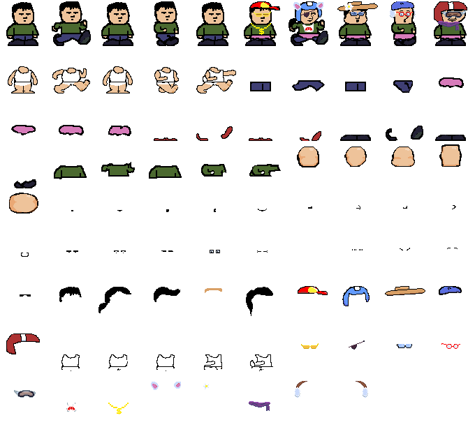
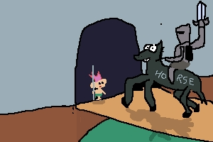
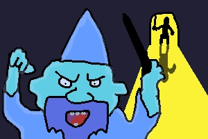

# phaser-game

[](https://www.npmjs.com/package/@dobuki/phaser-game)


This is the repo for the game:

## [The Supernatural Power Troll](https://jacklehamster.itch.io/power-troll)

[](https://jacklehamster.itch.io/power-troll)

Produced for [Gamedev.js Jam 2024](https://itch.io/jam/gamedevjs-2024)

[](https://itch.io/jam/gamedevjs-2024/rate/2664667)

- This is the first game I built using [Phaser](https://phaser.io)
- Coded using [VisualStudio Code](https://code.visualstudio.com/)
- The graphics were developed using [Aseprite](https://www.aseprite.org/) and further compressed using [ImageOptim](https://imageoptim.com/)
- music composed in [Beepbox](https://www.beepbox.co/)
- sound effects use in [ZZFX](https://killedbyapixel.github.io/ZzFX/)
- Voice use [SpeechSynthesisVoice API](https://developer.mozilla.org/en-US/docs/Web/API/SpeechSynthesisVoice)
- Some sounds were changed using [VoiceChanger.io](https://voicechanger.io/)

## Project's layout

```text
.
├── asprite: Asesprite files used to produce art assets like spritesheets.
├── beepbox: Links to all beepbox songs.
├── bundler: Use by bun.js to bundle the code code in "src" and make it available.
├── dist: Distributed files.
├── example: Where the game is packaged.
│   ├── assets: All assets (art, music, sound) used by the game.
│   ├── dist: Packaged JS files (bundled from typescript)
│   ├── json: All levels in JSON format.
│   ├── node_modules: dependencies
│   └── src: Just to pass source from outer "src" folder.
├── node_modules: dependencies
├── ...
└── src
    ├── config: Just the url to the API for fetching NPC dialog
    ├── example: Sample game started from tutorial. Not used.
    └── hischool: The entire game (initially I was planning a High School setting).
```

The repo follows the [bun-template](https://github.com/jacklehamster/bun-template) github template for TypeScript / React project, in which a package is built within the "src" directory, and the "example" directory uses the package as a library to show a demo of that package.

In this case, the core logic is in the "src" directory, while the rest of the game including the assets are all in the example directory.

## Start the project

### First install bun

This repo us built using **bun.js**. Install from [here](https://bun.sh/).

```bash
curl -fsSL https://bun.sh/install | bash
```

Then run:

```bash
bun i
```

### Execute the game

Execute:

```bash
./sample.sh
```

This builds the necessary file and start the server hosting the game, then starts the server from the "example" folder.

Then open the page in a browser "<http://localhost:3000>".

## GameJam

The theme of the gamejam is: **POWER**.

The game is a platform puzzle type where you control a troll that can grant supernatural powers to humans, by picking up and tossing powerups or placing them in their path.

The troll has to pick up a key and reach a door. He's not allowed to touch any human.

The game has various features detailed below. Furtherdowm, I will explain the implementation.

## Features

### Custom NPC look



Each NPC is composed of various body parts that are randomized at the start of each level. As such, every NPC look different. They can be male or female, wear hat or not, have different hairstyles, wear skirt, pants, or just underwear. They also have different skin colors.

### Powerups


Each powerup is acquired by a human one at a time. Acquiring a new powerup cancels the effect of a previous one.

Here are the different powerups available:

- **Super Jump**: Give the NPC the ability to do a high jump. A NPC will decide to high jump if they're on the edge of a platform. An NPC without super jump availability will generally drop off the platform, or turn back if there's an undesire creature at the end of it (snail, cat, slime...).
- **Levitate**: The NPC levitate a few meters up in the air, then floats above empty space. The leviation can stack to make the NPC levitate a few meters higher.
- **Super Strength**: The NPC has super strength, which in this game just means they're able to push heavy rocks.
- **Ice touch** (unused): The NPC turns other NPCs into ice, freezing them in place for a few seconds. In this game, this power is not used.
- **Ant man**: The NPC is shrunk 1/3 of its size, and is able to walk in small spaces. Even shrunk, the troll cannot touch any human.
- **Useless power**: This is a random powerup that has no effect in the game except for cancelling a previous powerup. It varies between the following powers:
  - "Math Wiz: The power to recite all digits of PI indefinitely.".
  - "MasterChef: The power to cook delicious meal.".
  - "NoShit: The power go several months without the need to go to the restroom.".
  - "I'm blue: The power to turn completely blue.". (This is the only useless power that shows an effect in the game. The NPC skin turns blue and they complain about it.).
  - "Burberry Man: The power to make their clothes disappear.",
  - "Weather Man: The power to predict the weather exactly one year from now.",
  - "Insect Man: The power to read the mind of an insect.",
- **Switcharoo**: This power swaps position with the closest human or troll.
- **Climb power**: Power to climb walls
- **Eject power**: Power to remove the current power and turn it back into a power-up, which will be thrown towards the troll.
- **Upside down**: Gravity is inverted for that human.

### AI Generated NPC dialog


Every few seconds, a random NPC makes a comment. It is most likely related to a recent event: Just saw the troll come and disappear, did a high jump, pushed a heavy rock, shrunk down, fell into the water, etc...

To generate the dialog, the history of events from an NPC is accumulated then passed on to OpenAI API to inform what happened to that NPC, and an appropriate response from the NPC is returned.
The description of the environment is also pased, if it's noteworthy. (like the "pizza" level).

### Quirky NPC behavior

Some surprising events cause the NPC to jump and pause for a moment. (saw a troll, just pushed a heavy rock).
The NPC also stops a walk for a bit before talking.

### Spoken voice synthesization

The NPC response is passed to the browser's voice synthesizer, which will speak the response along with showing the text.

The NPC voice is chosen at random at the beginning of each level. It doesn't always match the NPC look. Given that each voice has an association with a language, that information is passed to OpenAI, and the NPC ends up using words from their native language along with their response. (For ex: French NPCs love to say "Sacrebleu", and Mexican NPCs often say "Aye Caramba".).

### Level editor

[](https://jacklehamster.github.io/phaser-game/example/?serverless-edit=true#map=json/map13.5.json)

[Try it here!](https://jacklehamster.github.io/phaser-game/example/?serverless-edit=true#map=json/map13.5.json)

Each level is composed of several unique tiles, ranging from:

- platform: no gravity
- rock: has gravity, can be walked on, can be pushed by NPCs with super strength.
- key: has gravity, must be picked up and thrown at a door to open it.
- door: the exit, must be opened using a key
- bonuses: Power ups to be thrown at humans.
- triggers: Gravitiless, often placed at the end of platforms, not blocking for the troll but blocking for humans. This is used to prevent humans from walking off a platform and falling down. Normal humans will walk back, but humans with superjump will jump over them. In the game, there's often a small creature draw as decor to indicate those triggers.
- water: Water tiles. Deadly for troll, and makes humans stuck.
- NPC: Each NPC character.
- Troll: The troll

The level editor enables level editing while the game is running, to allow immediate adjustments.

- platforms: static. Can be moved around and resized.
- door, water, triggers: static, cannot be resized.
- bonus: switch bonus using the arrow key
- rock, water, key, NPC, troll: Only the initial position of the character can be moved, since those are all dynamic elements. Note: As soon as an initial position is moved, the corresponding element in the game moves there.

Pressing SHIFT + Clicking duplicates an element, allowing the editor to place more elements.

Pressing DELETE after selecting an item removes it.

Some level configurations are set manually in the json files: Decor overlay, if the level has pizza, gold walls, snail or cat, if it's locked (editor OFF), and what's the next level after completing it.

#### Demo

[Test the level editor](https://jacklehamster.github.io/phaser-game/example/?serverless-edit=true#map=json/map13.5.json)

## Implementation details

### Custom NPC look Implementation

NPCs are composed of two categories of elements:

- Face elements: Nose, eyes, mouth, hair, hat, shape.

```typescript
enum FaceEnum {
  SHAPE = 0,
  MOUTH = 1,
  NOSE = 2,
  EYES = 3,
  EYELASHES = 4,
  HAIR = 5,
  HAT = 6,
};
```

Those elements have no animation, so each one is unique. One of each is chosen as random to compose the face.
Each of those elements is overlayed on top of each other to produce a unique face when combined. There's also a random tint applied to the "shape" to change skin color.

When the NPC needs to talk, we alternate between the NPC's mouth, and the graphics showing the mouth opened. If the NPC's default mouth is opened, we alternate with a random mouth.

- Body elements: Each of those elements have an animation for still and walking, using ~5 frames. Body elements are just different types of clothings that can be included or ommited. Some clothings are exclusive (small and big shoes). A tint is applied to provide variety to the clothing colors.

```typescript
enum BodyEnum {
  BODY = 0,
  UNDERWEAR = 1,
  SHIRT = 2,
  PANTS = 3,
  SKIRT = 4,
  SMALLSHOES = 5,
  SHOES = 6,
};
```

Body and underwear will always be present. The tint of face's shape is applied to the body for consistency of the skin color.

Each body part is animated in sync, when the character is walking or standing still.

The function that sets up the look is `function randomSprite()`. We pass a seed, stored on each NPC, which will ensure the same seed passed will result to the same character customization. This is needed because we apply random tint when a character acquires a power-up, then we need to restore to normal once its done.

### Powerups implementation

When a NPC collides with a power up, that powerup is attached to the NPC (shown over the head). The NPC's various behavior is then modified depending on the powerup. This is done through custom code applied throughout.

- SuperJump: When collide with trigger or when NPC goes from touching ground to not-touching grown, set VelocityY to -1000
- Levitate: Set "flyingLevel" as the current Y position - 50. The NPCs gravity is turned off, and the NPC will always move towards that flying level. Note: Due to the implementation, if "levitate" is acquired when the character is jumping, the character might fly higher than expected.
- SuperStrength: This powerup doesn't have the best implementation, but it's one that works enough. This simply causes a rock to become "pushable" if an NPC with superstrength comes in contact with that rock. Once the rock stop being touched, the pushable flag is turned off. Note that this sometimes causes a problem: If two NPCs are pushing a rock against each other, sometimes the NPC without superstrength pushes the rock further. Another problem is that an NPC with superstrength could land on top of the rock, and another NPC without superstrength collides with that rock, the rock gets pushed.
- Ice Touch: Upon overlap or collision, if one human has Ice Touch, the other human will have a "frozen" tag set, causing movement to stop and tint to be blue. This is not used in any level yet.
- Ant Man: The scale of an NPC gets reduced to `INITIAL_SCALE - .7`. Initial scale is around 1, so the eventual size becomes roughly 1/3. That value gets restored when the NPC loses that power.
- Useless power: This is mainly used to remove another power. However, "I am blue" power causes a blue tint on skin (face shape and body.), and "burberry man" causes all clothes to disappear (except underwear).
- Switcharoo: First look for closest human or troll, then hide each, along with a "Vanish" animation. Then swap coordinates, and make them reappear. This is useful when the human swapped has a needed superpower.
- Climb: Currently not implemented.
- Eject power: Power gets turned back into a bonus, and thrown towards the troll. During the duration in which the human acquires a new powerup, the bonus doesn't interact with the human. This is to avoid the power ejected to be captured by the human immediately. However, if the powerup is still in contact with the human after being ejected (due to surrounding walls bouncing it back), the powerup will get re-acquired afterwards. (Note: For game design, I'm considering changing logic to make it so no powerup can be acquired by human with "eject power". Not yet sure which one would make more sense)
- Anti gravity power: Gravity and acceleration gets inverted (towards the top).

### AI generated dialog

As the game progresses, the NPC accumulates a history of events. Each event is added with the `addHistory()` function.
When it is time for an NPC to talk, a random one is chosen, then the history is passed to a rest API which URL is defined in OPEN_AI_URL.

The implementation of that API is at [https://github.com/jacklehamster/open-ai-npc](https://github.com/jacklehamster/open-ai-npc).

```typescript
  const url = `${OPEN_AI_URL}?dictionary=${JSON.stringify(dico)}&situation=${HumanEvent.LANG}.${situation}&seed=${seed ?? ""}&jsonp=fetchAIResponse`;
```

- **situation**: This is one long string, with sentences connected with "." They correspond to different events or description about the environment. The situation uses all the phrases from `DICO` in `human-events.ts`. The enums from `HumanEvent` is mapped to each phrase, then a history of what happened is composed and passed to the API.
- **DICO** (optional): Instead of passing each phrase strings into `situation`, we pass the entire dictionary of phrases, and situations will simply be a series of numbers (still separated with dots), corresponding to the index in the dictionary.
There's a specific reason for doing that, but it has not been yet implemented.

The idea is that situation can be constantly different, but it will eventually be just a series of numbers. Meanwhile, DICO will always remain the same. That means we could potentially take the MD5 of DICO and pass it to the server, and thus the server can whiltelist that MD5. This could prevent attackers from calling directly the server with random junk, thus dumping garbage to the OpenAI API (which might not be a really big deal).

The implementation could be changed to just pass the strings direcetly into `situation`, I don't think the `DICO` implementation is really necessary.

- **seed** (optional): When the seed number is passed, OpenAI will return the exact same response given the same prompt. The reason for this parameter is to somewhat reduced OpenAI calls through caching. If the seed keeps changing, nothing can get cached and OpenAI will always get called. Using the seed, the hope is that sometimes, calls with the exact same situation can hit the cache (and save some money).
We keep changing the seed for the same player to avoid repeating dialog. Initially, the hope is that two different players could encounter the same situation, thus hitting the same cache. That said, given how random the game has become, hitting the cache is now unlikely.
- **jsonp**: When the game is hosted on a portal like itch.io or newgrounds, we can't call the rest API directly due to cross-domain restrictions. What we can do however is ask the server to wrap an API response into a JavaScript call, then instead of calling the server, we change the source inside a `<script>` tag, which will call a javascript function of our choice.
This is a trick to bypass cross-domain restriction. I just didn't have time to figure out this whole domain restriction mess during the gamejam.
- **language**: Each NPC has a chosen voice, with a language associated (en-US, fr-FR, ko-KR...). Those voices can still speak English, but they clearly have an accent. To make the responses more interesting, I thought of passing the voice's language to inform OpenAI that this is the speaker's native language.
As a result, the NPC will often include unique responses mixing English and words from the native language, like "Sacrébleu, I have superstrength...". I do think though that OpenAI is falling victim of stereotypes, because in reality, NOBODY SAYS "SACREBLEU" IN FRANCE!

Once the rest API responds a speech for the NPC, that speech is passed into the Speech Synthesizer which will make the computer "speak" the sentence.
We also use utterance ["boundary" event](https://developer.mozilla.org/en-US/docs/Web/API/SpeechSynthesisUtterance/boundary_event) to make the words written on the screen match the timing of the speech.

### Run the OpenAI api locally

Fetch the source from: [https://github.com/jacklehamster/open-ai-npc](https://github.com/jacklehamster/open-ai-npc)

Then start the server using the `./start.sh` command, which will run the server locally on <http://localhost:3001>

Then change the OpenAI URL from <https://open-ai-npc.onrender.com/comment/> to <http://localhost:3001/comment/>.

There's two locations to change `OPEN_AI_URL`. One in `constants.ts` and one in `example/index.ts`.

When fetchAI is called, the "jsonp" parameter can be passed as true or false. When passed as true, the API call is made using jsonp (use a `<script>` tag which will call the function `fetchAIResponse`.). If the server is local, that's not necessary, so the API call can just be made through the `fetch()` function.

### Level Editor

When the game is hosted locally on a server, we enable the level editor.

The local server contains API for saving elements from the game diretly into the `mapN.json` JSON that was used for configuring the level.

Every time an element is moved, the `commit()` function is called, passing the ID of the element moved. If a new element is created, a new ID for it is generated, so the server will know to create a new element in the `mapN.json` file.

During the game, there are some UI components that can be enabled in edit mode, allowing an editor to drag elements to move or resize them. Those are just implemented as part of the game, and enabled only in edit mode. Thus, the game can be edited when it is played. An editor can try a level, find out that a particular jump is impossible, then just resize, place the troll back to its original position and try again. This allows for some very fast iteration.

### Game art

The game has unique art for each level. While it's time consuming, it does make some art development a bit easier.

The way each level is designed, is that I first remove the "overlay" from a map, then place the elements around to make the level solvable. Afterwards, once the platforms are clearly defined, I dump a screenshot of it into "Aseprite", then draw some art on top of the platform. Then I save that as a PNG. I then set that as the overlay of the level, so every piece of art will just cover the platforms in the game.


```json
{
 "overlay": "assets/overlay1.png",
  ...
}
```

### Music and sound

Each level song is an mp3 played by phaser, depending on the level:

```typescript
    preload() {
      this.load.audio('main', ['assets/troll-song.mp3']);
      ...
    }

    create()
    {
      this.music = this.sound.add(parseInt(level) % 2 === 1 ? 'main' : 'main2');
      this.music.loop = true;
      this.music.play();
      ...
    }
```

For sound effect, the zzfx is called directly from the code provided from the [web tool](https://killedbyapixel.github.io/ZzFX/).

```typescript
  zzfx(...[1.52, , 1177, .23, .09, .09, 1, 1.41, 12, , , , , .4, , , .06, .25, .11, .11]); // Random 348
```

### Cut scene




Cut scenes are implemented outside of Phaser, for simplicity.
The code is in `example/index.html`.

The cutscene is defined within the structure in variable `CUT_SCENES`.
Each element is a string with:

```typescript
[
  imageUrl,
  textToDisplay,
  urlOfMusic,
  loopTheMusic, //  true or false
  fadeToTheImage,   //  true or false. True causes the previous image to fade out, the current one to fade in.
]
```

## Commit process for Github

Repos generated using the [bun-template](https://github.com/jacklehamster/bun-template) all use the same method to publish.

Using the following command, the repo gets commited, pushed to Github, then published to "npmjs".

```bash
./auto-publish.sh
```

The script generates its own commit message, so to get a meaningful message, it's best to first commit manually.

While publishing to npmjs might not make sense for a standalone game, this is useful when producing reusable packages that can be imported in various javascript projects.

## Package for game portals (itch.io, Newgrounds)

Game portals require a single zip file which contain the entire website of the game, starting with the "index.html" file. That's the "example" folder.

Server code is ignored by game portals, so they don't need to be removed from it.
The "node_modules" must be deleted before zipping the "example" folder because they contain a large amount of folders, that are also not needed by the website.

## Run example from Github website

[https://jacklehamster.github.io/phaser-game/example/](https://jacklehamster.github.io/phaser-game/example/)

## Run game on Itch.io

[](https://jacklehamster.itch.io/power-troll)

[https://jacklehamster.itch.io/power-troll](https://jacklehamster.itch.io/power-troll)

## Github Source

[https://github.com/jacklehamster/phaser-game/](https://github.com/jacklehamster/phaser-game/)

## NPM Package

[https://www.npmjs.com/package/@dobuki/phaser-game](https://www.npmjs.com/package/@dobuki/phaser-game)
